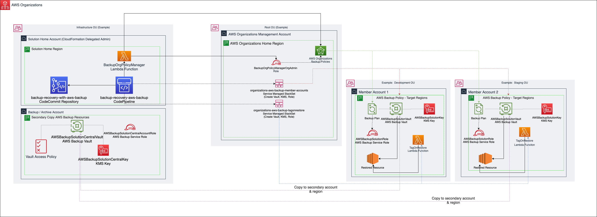

# Backup and Recovery with AWS Backup

This repository provides you with a management and deployment solution for implementing Backup and Recovery with AWS Backup across your AWS organization spanning multiple accounts and regions.

Check out the AWS Blog post for more context: [Use AWS Backup and CI/CD tools to automate centralized backup across AWS services](https://aws.amazon.com/blogs/storage/use-aws-backup-and-ci-cd-tools-to-automate-centralized-backup-across-aws-services/)

The solution includes the following features:

* Deployment guide and CloudFormation templates for setting up the baseline solution architecture
* CodePipeline for orchestrating and automating the management, testing, and deployment of solution components
* Lambda backed CloudFormation custom resource for managing AWS Organization Backup policies using CloudFormation
* Lambda function to automatically re-apply tags to restored resources from AWS Backup
* S3 bucket for centralized, automated deployment of lambda function to new accounts and regions.
* CodeBuild project for static analysis of CloudFormation templates using cfn-nag
* CodeBuild projects for packaging and deploying the solutions Lambda functions 
* Vault, KMS Key, and service role for deployment of AWS Backup to each account and region
* Vault, KMS Key, and service role for centralized AWS Backup for secondary backup storage from all accounts and regions.
* Sample AWS Organizations Service Control Policy to limit sharing and copying of AWS Backup vaults to only AWS accounts within the AWS Organization.

You should deploy and modify this solution to meet your needs in a non-production environment.
 
## Solution architecture and design
The following diagram illustrates the AWS Backup automation solution discussed in this blog and repository:

#### **Solution Home Account:**
* Solution CodeCommit Repository - **backup-recovery-with-aws-backup**:  This repository stores all the scripts and templates for the solution.
* Solution CodePipeline - **backup-recovery-with-aws-backup**:  This pipeline orchestrates the deployment of all solution components.
* KMS Key for CodePipeline artifacts - **aws-backup-codepipeline-kms**: 
* IAM Service Role for AWS CloudFormation - **CloudFormationRole**:
* Solution CodeBuild Projects: 
  * **ValidateTemplates**: 
  * **TestAndPackageTagOnRestore**: 
* Deployment S3 Bucket (auto generated name): 
* Lambda Deployment Bucket - For Each Target Region **(lambda-deployment-bucket-${AWS::AccountId}-${AWS::Region})**:
* Systems Manager Parameter Store Parameters: 
  * **/backup/bucket**:
  * **/backup/org-id-management-account**:
  * **/backup/org-management-account**:
  * **/backup/home-account**:
  * **/backup/central-vault-arn**
  * **/backup/target/global-region**
  * **/backup/target/regions**
  * **/backup/target/organizational-units**  
  * **/backup/lambda/bucket-prefix**
  * **/backup/lambda/aws-backup-tagonrestore/deployed-package**
  * **/backup/lambda/aws-backup-tagonrestore/deployed-hash**

#### Central AWS Backup Account
* Central AWS Backup Vault (**AWSBackupSolutionCentralVault**)
* Central AWS Backup KMS Key (**AWSBackupSolutionCentralKey**)
* Central AWS Backup Service Role (**AWSBackupSolutionCentralAccountRole**)

#### AWS Organizations Accounts managed with AWS Backup Organization Policy
* AWS Backup Account Vault (**AWSBackupSolutionVault**)
* AWS Backup Account KMS Key (**AWSBackupSolutionKey**)
* AWS Backup Account Service Role (**AWSBackupSolutionRole**)
* Lambda Function to automate retagging on AWS Backup restore operation (**TagOnRestore**)

## Prerequisites

### AWS Organizations with all features enabled.

If your AWS Organization doesn't have all features enabled, then enable all features in AWS Organizations.
With only consolidated billing features enabled, you cannot create a stack set with service-managed permissions which are required for the baseline architecture.

The Backup and Recovery with AWS Backup solution uses a service-managed StackSet to configure AWS Backup in accounts within the AWS Organization Units (OUs) you specify.  New accounts added to the target OUs will automatically be configured with the Backup and Recovery with AWS Backup solution.

If you don't do this, then you will need to self-manage StackSet deployments to target accounts to configure AWS Backup.  This will require you to provision the necessary CloudFormation StackSet Execution roles into new accounts and then establish a trust relationship with the AWS StackSet administration account.  You will also need to manage new account additions and deletions as well if you don't use service-managed StackSets.

If StackSets have not been configured yet in your AWS Organizations management account then you will need to configure StackSets first.

You will need to enable trusted access between AWS CloudFormation StackSets and AWS Organizations.  You can [follow the directions in the CloudFormation documentation](https://docs.aws.amazon.com/organizations/latest/userguide/services-that-can-integrate-cloudformation.html).

* Confirm that setup was successful:

      aws organizations list-aws-service-access-for-organization

### Register Delegated Administrator account 

Your AWS Organizations management account is the only account that has rights to deploy service-managed CloudFormation stacksets, by default.  However, you can register other accounts as delegated administrators for AWS Organizations features such as service-managed stack set deployments.  As a best practice, the baseline architecture designates a specific account called the **solution home account** and a specific region called the **solution home region** where you will deploy the majority of the solution components.  This account must be registered as a delegated administrator because it will deploy and update the service-managed stacksets used in the solution.  

Take the following steps to enable delegated administrator permissions for your organization:

* Register the solution home account as a delegated administrator: 

      aws organizations register-delegated-administrator --account-id=<Solution Home AWS Account Number> --service-principal=member.org.stacksets.cloudformation.amazonaws.com 

* Verify that the registration succeeded:

      aws organizations list-delegated-administrators

# Deployment
Follow the instructions below, confirming that each created CloudFormation stack is in the **CREATE_COMPLETE** state 
before proceeding with the next step.

## Grant solution home account Delegated Administrator permissions for AWS Organizations Backup Policies
Before you can manage and update AWS Organizations backup policies from another AWS account, you need to grant that account permissions via a [resource-based delegation policy](https://docs.aws.amazon.com/organizations/latest/userguide/orgs_delegate_policies.html) in your AWS Organizations management account.  

The [aws-backup-org-resource-policy-delegate-backup-policy-mgmt.yaml](aws-backup-org-resource-policy-delegate-backup-policy-mgmt.yaml) CloudFormation template has been provided to deploy a resource-based delegation policy that grants the AWS account you have chosen for the solution to manage AWS Backup policies for the AWS organization.

Run this command to deploy the policy in your AWS Organizations Management account.  Make sure your permissions are set to your AWS Organizations management account:

      aws cloudformation create-stack \
          --stack-name "aws-backup-org-resource-policy-delegate-backup-policy-mgmt"  \
          --template-body "file://aws-backup-org-resource-policy-delegate-backup-policy-mgmt.yaml" \
          --parameters ParameterKey=SolutionHomeAccountId,ParameterValue=<The AWS Account Id where you are deploying the solution> \
          --tags "Key"="Application","Value"="Backup and Recovery with AWS Backup Solution" \
          --region <run this command in one region of your choice>

## Central Backup Account Backup Configuration
You must choose a single account that you wish to be the secondary store for backup copies for your AWS Organization.  This account will receive a copy of each backup performed in the organization for the organization units you have specified in the solution.  You should choose an account where permissions have been limited appropriately to administrative users.

The central account configuration is completed by:

A. Deploying the AWS Backup Service Account role to the account.

B. Deploying the solution resources for the central account such as the backup vault and KMS key.

### A. Deploy Centralized Backup Account Role
The AWS Backup service uses a service role in order to perform AWS Backup operations.  You need to create this role in the central account in order to work with the AWS Backup service in this account.

You deploy this role to a **single** region of your choice using the following command:

      aws cloudformation create-stack \
          --stack-name "aws-backup-solution-central-account-role"  \
          --template-body "file://aws-backup-central-backup-account-role.yaml" \
          --tags "Key"="Application","Value"="Backup and Recovery with AWS Backup Solution" \
          --capabilities CAPABILITY_NAMED_IAM \
          --region <run this command in one region of your choice>

### B. Deploy Centralized Backup Account Configuration Stack
The solution creates a central AWS Backup Vault and KMS key in a region of your choice.  You may decide to use a different region than your backed up resources based on your requirements.

You can deploy the related solution resources for the centralized backup account using the following command in a region of your choice:

      aws cloudformation create-stack \
          --stack-name "aws-backup-solution-central-account"  \
          --parameters ParameterKey=pOrganizationId,ParameterValue=<The AWS Organizations ID where the solution will be used> \
          --template-body "file://aws-backup-central-backup-account.yaml" \
          --tags "Key"="Application","Value"="Backup and Recovery with AWS Backup Solution" \
          --capabilities CAPABILITY_NAMED_IAM \
          --region <run this command in one region of your choice>

Make sure you enter the AWS Organization ID (e.g. o-abcd123456) for your AWS Organization for the **pOrganizationId** parameter value.

After deployment completes, make note of ARN for the central backup vault you deployed.  You will need this during the solution home account configuration in the next section.

You can retrieve the ARN using this command:

    aws cloudformation describe-stacks --stack-name "aws-backup-solution-central-account"  \
    --query "Stacks[0].Outputs[?ExportName=='aws-backup-central-backup-vault-arn'].OutputValue" \
    --region <your solution home region> \
    --output text

## AWS Backup Solution Home Account Configuration

You need to select a AWS home account and AWS home region where the solution will be deployed.  This includes the CodeCommit repository, CodePipeline,  and related AWS resources to support deployment and management.

CodePipeline will orchestrate deployment and management of the solution components to all the AWS Organization Member accounts specified in your AWS Backup policies (i.e. KMS Key, Backup Vault, AWS Backup Service Role)

### 1. Enable Self-Managed StackSet Administration

You need to grant [self-managed stackset permissions](https://docs.aws.amazon.com/AWSCloudFormation/latest/UserGuide/stacksets-prereqs-self-managed.html) so that the management account can use stacksets to deploy / manage solution components across multiple regions within the account.

If you haven't already done this in the account where the solution is deployed, you can create the necessary AWSCloudFormationStackSetAdministrationRole and AWSCloudFormationStackSetExecutionRole IAM roles for the solution home account by deploying the following stacks:

        aws cloudformation create-stack \
        --stack-name "aws-cloudformation-stackset-admin-role"  \
        --template-body "file://aws-cloudformation-stackset-admin-role.yaml" \
        --tags "Key"="Application","Value"="Backup and Recovery with AWS Backup Solution" \
        --capabilities CAPABILITY_NAMED_IAM \
        --region <run this command in the home region of your choice>

        aws cloudformation create-stack \
        --stack-name "aws-cloudformation-stackset-execution-role"  \
        --template-body "file://aws-cloudformation-stackset-execution-role.yaml" \
        --parameters ParameterKey=AdministratorAccountId,ParameterValue=<The AWS Account ID for the home solution> \
        --tags "Key"="Application","Value"="Backup and Recovery with AWS Backup Solution" \
        --capabilities CAPABILITY_NAMED_IAM \
        --region <run this command in the home region of your choice>

Make sure you enter the solution home AWS account id for the **AdministratorAccountId** parameter value.

### 2. Deploy S3 Bucket

An S3 bucket is used by CodeCommit to create the initial CodeCommit repository as well as by CodePipeline as the Artifact store.

You deploy this S3 bucket using a CloudFormation stack in the solution home account and solution home region using the following command:

        aws cloudformation create-stack \
        --stack-name "aws-backup-s3-bucket"  \
        --template-body "file://aws-backup-s3-bucket.yaml" \
        --tags "Key"="Application","Value"="Backup and Recovery with AWS Backup Solution" \
        --capabilities CAPABILITY_NAMED_IAM \
        --region <run this command in the home region of your choice>

### 3. Deploy KMS Key
A KMS key is used to encrypt CodePipeline artifacts.

Deploy the KMS key in the solution home account and region that you have selected.

      aws cloudformation create-stack \
          --stack-name "aws-backup-codepipeline-kms-key"  \
          --template-body "file://aws-backup-codepipeline-kms.yaml" \
          --tags "Key"="Application","Value"="Backup and Recovery with AWS Backup Solution" \
          --capabilities CAPABILITY_NAMED_IAM \
          --region <run this command in the home region of your choice>

### 4. Deploy CloudFormation service role used by CodePipeline

A separate IAM service role is used by CodePipeline in the solution for CloudFormation related stack / stackset operations.  This role needs to be deployed in the solution home account.  

      aws cloudformation create-stack \
          --stack-name "aws-backup-codepipeline-cloudformation-role"  \
          --template-body "file://CloudFormationRole.yaml" \
          --parameters ParameterKey=OrganizationManagementAccountId,ParameterValue=<The AWS Account Id for the AWS Organizations Management account> \
          --tags "Key"="Application","Value"="Backup and Recovery with AWS Backup Solution" \
          --capabilities CAPABILITY_NAMED_IAM \
          --region <run this command in the home region of your choice>

### 5. Deploy CodeBuild Projects

CodeBuild projects are used by CodePipeline for static analysis and packaging and testing the AWS Lambda functions used by the solution.  

Deploy the CodeBuild projects in the home account and region that you have selected for the solution.

#### A. Deploy CodeBuild Project AWSBackup-ValidateTemplate

This CodeBuild project performs static analysis on the CloudFormation templates used in the solution using cfn-nag.

You deploy this CodeBuild project using a CloudFormation stack in the home region and account using the following command:

        aws cloudformation create-stack \
        --stack-name "aws-backup-codebuild-validate-templates"  \
        --template-body "file://codebuild/ValidateTemplates/aws-backup-codebuild-validate-templates.yaml" \
        --tags "Key"="Application","Value"="Backup and Recovery with AWS Backup Solution" \
        --capabilities CAPABILITY_NAMED_IAM \
        --region <run this command in the home region of your choice>

#### B. Deploy CodeBuild Project AWSBackup-TestAndPackageTagOnRestore

This CodeBuild project packages and tests the TagOnRestore AWS Lambda function code for subsequent deployment as a CloudFormation StackSet by CodePipeline.

You deploy this CodeBuild project using a CloudFormation stack in the home region and account using the following command:

        aws cloudformation create-stack \
        --stack-name "aws-backup-codebuild-test-package-tagonrestore"  \
        --template-body "file://codebuild/TestAndPackageTagOnRestore/aws-backup-codebuild-test-package-tagonrestore.yaml" \
        --tags "Key"="Application","Value"="Backup and Recovery with AWS Backup Solution" \
        --capabilities CAPABILITY_NAMED_IAM \
        --region <run this command in the home region of your choice>

### 6. Update SSM Targets configuration file [aws-backup-ssm-targets.json](template-configurations/aws-backup-ssm-targets.json)

Update the values for the following JSON keys in the [aws-backup-ssm-targets.json](template-configurations/aws-backup-ssm-targets.json) file:

* "**TargetHomeAccount**" : Enter the AWS Account number for the management solution home. (e.g. "123456789012")
* "**TargetRegions**" : Enter the AWS regions that you will backup using the solution as a comma separated list (e.g. "us-east-1, us-east-2") 
* "**TargetGlobalRegion**" : Enter the AWS region where global resources such as IAM roles will be deployed (e.g. us-east-1)
* "**TargetOUs**" : Enter the target AWS Organizations organizational units that contain the accounts that you will backup using the solution as a comma separated list (e.g. "ou-najk-4244kagu,ou-najk-58bsjit0")
* "**CentralBackupVaultArn**": Enter the ARN for the Central Backup Vault where secondary copies of your backups will be stored (e.g. arn:aws:backup:us-east-1:123456789012:backup-vault:AWSBackupSolutionCentralVault)
* "**OrgIdManagementAccount**": Enter the AWS organization for your AWS Organizations management account (e.g. "o-1234567890")
* "**OrgManagementAccount**": Enter the AWS account number for your AWS Organizations management account (e.g. "123456789012")

This parameter in this file are used by CodePipeline to deploy the [aws-backup-ssm-targets.yaml](aws-backup-ssm-targets.yaml) CloudFormation template.

### 7.  Update the [aws-backup-org-policy.yaml](aws-backup-org-policy.yaml) CloudFormation template

The [aws-backup-org-policy.yaml](aws-backup-org-policy.yaml) CloudFormation template is used to manage your AWS Organizations Backup policies.  The template uses the [AWS::Organizations::Policy](https://docs.aws.amazon.com/AWSCloudFormation/latest/UserGuide/aws-resource-organizations-policy.html) to manage Backup policies for the AWS Organization as a delegated administrator via CloudFormation.

Ensure that you have given your solution home account delegated administrator permissions as described in the first step of this deployment section.

The provided template uses the [Fn::ToJsonString](https://docs.aws.amazon.com/AWSCloudFormation/latest/UserGuide/intrinsic-function-reference-ToJsonString.html) CloudFormation transformation, allowing you to manage your [Backup Policies](https://docs.aws.amazon.com/organizations/latest/userguide/orgs_manage_policies_backup_syntax.html#backup-policy-syntax-reference) in YAML syntax within CloudFormation.

This example implements the following policy properties:

* For all supported resources in the target regions and target OUs that are tagged with the tag key **backup** and the tag value **daily**, perform a nightly backup at 05:00 UTC.  The backup will have a retention period of 35 days.  The backups will also be copied to the selected central backup vault.  If the backup doesn't complete in 1200 (20 hours) then it will be cancelled.
* For all supported resources in the target regions and target OUs that are tagged with the tag key **backup** and the tag value **monthly**, perform a monthly backup at 05:00 UTC on the first day of each month.  The backup will have a retention period of 366 days.  The backups will also be copied to the selected central backup vault.  If the backup doesn't complete in 1200 (20 hours) then it will be cancelled.

At a minimum, update the **copy_actions** key with your central backup vault ARN in the [aws-backup-org-policy stack](./aws-backup-org-policy.yaml) CloudFormation template.  The key value has a placeholder called **<Replace with value from pCentralBackupVaultArn>**.  You must do this for each resource defined in the template.

### 8. Deploy CodeCommit Repository

CodeCommit is used by the solution for version control and is integrated with CodePipeline to establish a CI/CD management solution.

First, zip all the files in the repository using a command similar to this:

    zip -r aws-backup-solution.zip *

Now, identify the name of the S3 bucket that you created earlier using the following command:  

    aws cloudformation describe-stacks --stack-name "aws-backup-s3-bucket"  \
    --query "Stacks[0].Outputs[?ExportName=='aws-backup-s3-bucket-name'].OutputValue" \
    --region <your solution home region> \
    --output text

Next, copy the zip file to the S3 bucket with the following command:

    aws s3 cp ./aws-backup-solution.zip s3://<bucket name>

Finally, deploy the CloudFormation stack to create the CodeCommit repository:

        aws cloudformation create-stack \
        --stack-name "aws-backup-codecommit"  \
        --template-body "file://aws-backup-codecommit.yaml" \
        --tags "Key"="Application","Value"="Backup and Recovery with AWS Backup Solution" \
        --capabilities CAPABILITY_NAMED_IAM \
        --region <run this command in the home region of your choice>

### 9. Deploy CodePipeline

CodeCommit is used by the solution for CI/CD.  CodePipeline uses the CodeCommit repository that you created.

Deploy the CodePipeline for the solution using the following command:

        aws cloudformation create-stack \
        --stack-name "aws-backup-codepipeline"  \
        --template-body "file://aws-backup-codepipeline.yaml" \
        --tags "Key"="Application","Value"="Backup and Recovery with AWS Backup Solution" \
        --capabilities CAPABILITY_NAMED_IAM \
        --region <run this command in the home region of your choice>

The pipeline will automatically execute using the CodeCommit repository you deployed.  

The pipeline will deploy the solution components in the solution account and member accounts.  

The last step in the pipeline deploys and manages the AWS Backup policies as a delegated administrator into the AWS Organizations Management account.

## Security

See [CONTRIBUTING](CONTRIBUTING.md#security-issue-notifications) for more information.

## License

This library is licensed under the MIT-0 License. See the LICENSE file.

